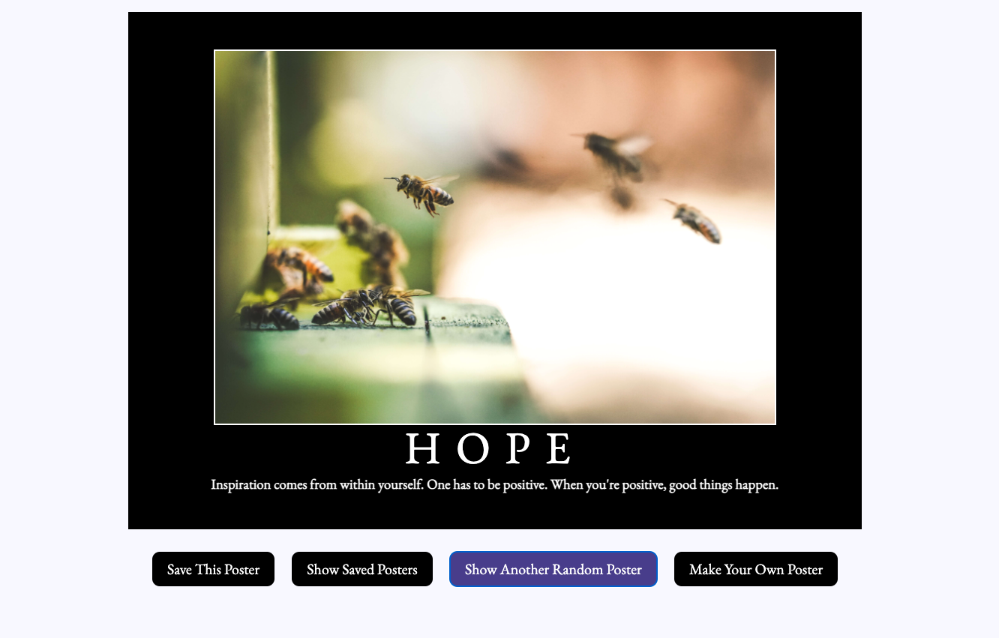
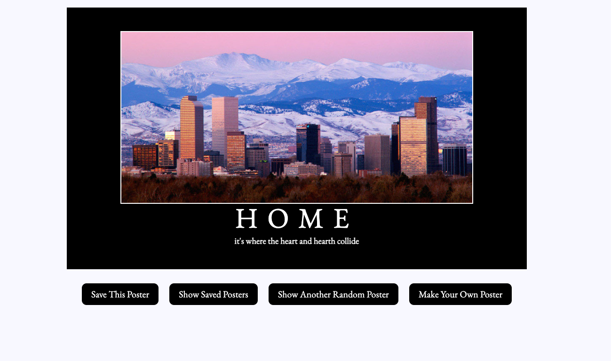
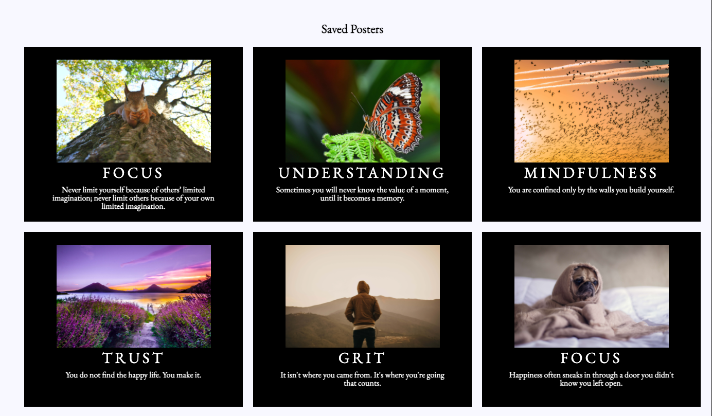
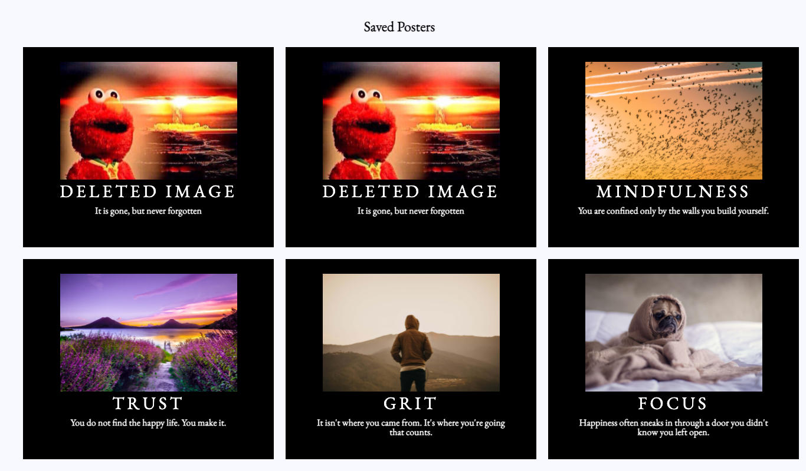

# Hangin' In There with Rio and Jordan

 

### Project Description
---
Hangin' In There With Rio and Jordan is a project dedicated to the artful craft of the generation of motivational posters. 

We used these posters to test our abilities to transform the given HTML and CSS code using only Javascript.

### Contributors
---
---
>**Rio Foster**
- Project Co-Lead | GitHub Profile: [friotious](https://github.com/friotious)

>**Jordan Skomal**
- Project Co-Lead | GitHub Profile: [jskomal](https://github.com/jskomal)

---

>**Nick Teets**
- Project Mentor | GitHub Profile: [nicktu12](https://github.com/nicktu12)

    - Approved Pull Request for [iteration2/js](https://github.com/jskomal/hanging-in-there-with-rio-and-jordan/pull/3)

>**Matt Walker**
- Project Mentor | GitHub Profile: [mttwlkr](https://github.com/mttwlkr)

    - Approved Pull Request for [iteration3/rf](https://github.com/jskomal/hanging-in-there-with-rio-and-jordan/pull/4)

---
---

### Deployment

This project website can be accessed [here](https://jskomal.github.io/hanging-in-there-with-rio-and-jordan/)!

---

### Tech Used

This project was written with provided HTML and CSS files, all functionality is written in Javascript.

---
### Features

Throughout the various iterations of this project, we added functionality in a consise and operationally orgaized manner. 

Completeing tasks such as:

- [x] Generating a randomized image, title, and quote upon page load
- [x] Ensuring that all button functionality works as intended, and that all code written for that functionality is DRY and consise
- [x] Adding duplicate protection to both our poster container and the saved poster grid
- [x] Replacing deleted images with a default placeholder image

---

### Project Gallery

#### Default view

---

#### Custom Image, Title, and Quote view

---
#### Saved Image Grid view

---
#### Deleted Image Grid view

